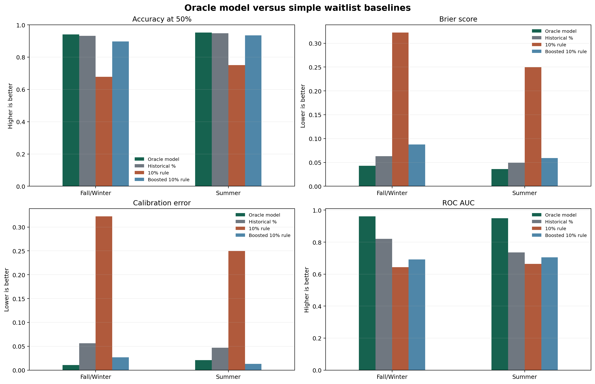
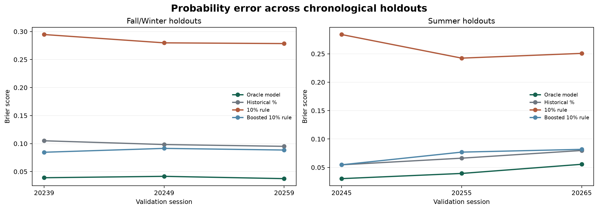

# UofT Waitlist Oracle

UofT Waitlist Oracle estimates the probability that a waitlist will record
enough cumulative downward movement to cover an entered position for a specific
University of Toronto course and lecture section. It combines the current
queue, section capacity, time remaining, recent movement, course context, and
public enrollment history in a model that runs entirely in the browser.

Every estimate is accompanied by the underlying outcomes from previous lecture
offerings. The percentage is a statistical estimate—not a guarantee, academic
advice, or an official U of T forecast.

## Methodology

### Reconstructing the queue

The public archive records enrollment demand, section capacity, capacity
changes, and collection timestamps. At each observation, the inferred waitlist
size is:

```text
max(enrollment demand - section capacity, 0)
```

Offerings are aligned by days remaining before the applicable U of T waitlist
deadline, rather than by calendar date or enrollment deadline.

### Live queue freshness

The live collector can lag behind a student joining a waitlist. The website
therefore accepts ranks up to five positions beyond the latest inferred queue.
When no waitlist is recorded, ranks 1 through 5 remain available for this
freshness allowance. For live model inputs, the current queue is the larger of
the latest inferred queue and the entered rank. That effective queue is used
for the model's queue and queue-ratio features. Recent-movement features remain
the actual changes between archived snapshots.

### Defining the target

The archive does not identify individual students or record admission offers.
Starting at each snapshot, the model adds every subsequently observed downward
queue step through the final sufficiently complete pre-deadline observation:

```text
sum(max(previous queue - next queue, 0))
```

The target is whether that cumulative observed movement reaches a given rank.
Later arrivals can refill the queue, but they do not erase movement that was
already visible.

This is not verified student advancement. A departure behind a student can
shrink the queue without advancing that student, while a departure ahead that
is offset by a new arrival between snapshots can be invisible. The proxy can
therefore err in either direction. Capacity increases can also contribute to
an observed decrease.

Each training row represents one waitlist rank in one lecture on one observed
day. The legacy internal target column is named `cleared`, but it is 1 when
cumulative observed downward movement reaches that rank. The percentage
estimates this archive-derived target, not the probability of receiving an
offer directly.

### Model

The Oracle uses separate histogram gradient-boosted tree models for
Fall/Winter and Summer. Each ensemble contains 200 small trees with at most 15
leaves and L2 regularization of 3. Missing numeric values are filled with the
training median. Calibration is selected on earlier same-season sessions.
Fall/Winter uses isotonic calibration, while Summer uses Platt scaling.

The production model has 26 numeric features:

- **Rank:** raw rank, rank divided by capacity, and rank divided by current
  waitlist size
- **Queue:** raw waitlist size, log waitlist size, and waitlist divided by
  capacity
- **Capacity:** section capacity and whether capacity changed in the previous
  seven days
- **Time:** days before the waitlist deadline, squared days, a seven-day flag,
  days below seven, days below fourteen, and days beyond sixty
- **Movement:** observed movement over three days, observed movement over seven
  days, and seven-day movement velocity
- **Interactions:** rank-to-capacity and waitlist-to-capacity near the deadline,
  plus an indicator for ranks above 30% of capacity
- **Context:** campus and course-term indicators, including their near-deadline
  interactions

Lecture selection determines the live capacity, queue, and movement inputs.
Lecture identifiers such as `LEC0101` are not themselves predictors.

### Understanding Driven by

The **Driven by** list is a local explanation of the displayed estimate. The
browser changes one underlying factor toward its typical training value and
recomputes every dependent ratio and interaction together. A `+` means the
entered case raises the estimate relative to that coherent comparison, while a
`−` means it lowers it. Because trees contain interactions, these effects do
not need to add up to the displayed percentage and should not be interpreted as
causal.

### Training and validation

The archive covers completed Fall/Winter and Summer sessions from 2022 through
Summer 2026. Evaluation uses rolling-origin validation rather than a random
train/test split. There are six holdouts, three per season:

| Model       | Training sessions | Validation session |
|-------------|------------------:|-------------------:|
| Fall/Winter |         2022–2023 |          2023–2024 |
| Fall/Winter |         2022–2024 |          2024–2025 |
| Fall/Winter |         2022–2025 |          2025–2026 |
| Summer      |              2023 |               2024 |
| Summer      |         2023–2024 |               2025 |
| Summer      |         2023–2025 |               2026 |

Each fold adds the previous validation session to the next training set. The
model therefore predicts a future session using only information that would
have existed at that time. No rows from the validation session enter its
training data, preprocessing statistics, category encoding, or capacity-only
baseline fit.

The earlier holdouts are used for development selection and same-season
calibration. The last session of each season is evaluated only after features,
hyperparameters, calibration choices, and release gates are locked. The tables
below report those latest-session results. After evaluation, the two production
models are refit on all completed sessions available to their season. The
current session is used only to construct live prediction inputs.

After sampling, position rows are renormalized so every retained lecture
offering contributes total weight 1 and each retained day contributes equally
within that offering. This prevents large queues, longer collection histories,
or random differences in retained rows from dominating training or scoring.

Four metrics capture different parts of performance:

- **Accuracy** is the share of correct target-met or target-not-met predictions using a
  50% cutoff.
- **Brier score** measures the error in the probabilities themselves. Lower is
  better.
- **Expected calibration error (ECE)** measures whether stated probabilities
  match observed outcomes. Lower is better.
- **ROC AUC** measures how well a method ranks likely target-met rows above likely
  misses. Higher is better.

## Benchmark against simple rules

The locked latest-session benchmark and figure generation are available in
[V2 Notebook 4](notebooks/v2/04_latest_session_evaluation_and_release.ipynb).
The full modelling sequence is documented in the
[version 2 notebook guide](notebooks/v2/README.md).

The Oracle is compared with three understandable baselines:

- **Historical percentage:** the success rate of the previous lecture offerings
  listed when you query the Oracle. A lecture counts as a success when its
  cumulative observed downward movement after the equivalent date was at least
  the entered position.
- **Literal 10% rule:** predicts that movement reaches the entered position when rank is no more than 10% of lecture
  capacity.
- **Boosted 10% rule:** a fitted probability curve that still uses only
  waitlist rank divided by lecture capacity.

The Oracle and both capacity baselines are scored on every validation row. The
historical percentage is available only when an earlier lecture reached the
exact entered position. A second table therefore compares all four methods on
that common subset, which covers 72.3% of Fall/Winter evaluation weight and
54.3% of Summer evaluation weight.

### Latest-session performance on all evaluation rows

| Season      |           Method |  Accuracy |      Brier |        ECE |    ROC AUC |
|-------------|-----------------:|----------:|-----------:|-----------:|-----------:|
| Fall/Winter |     Oracle model | **97.4%** | **0.0170** |     0.0065 | **0.9853** |
| Fall/Winter | Literal 10% rule |     94.9% |     0.0512 |     0.0512 |     0.5006 |
| Fall/Winter | Boosted 10% rule |     95.8% |     0.0406 | **0.0026** |     0.5232 |
| Summer      |     Oracle model | **93.6%** | **0.0496** |     0.0229 | **0.9214** |
| Summer      | Literal 10% rule |     73.3% |     0.2667 |     0.2667 |     0.6518 |
| Summer      | Boosted 10% rule |     91.1% |     0.0778 | **0.0130** |     0.6864 |

### Direct comparison on the historical-comparable subset

| Season      |                Method |  Accuracy |      Brier |        ECE |    ROC AUC |
|-------------|----------------------:|----------:|-----------:|-----------:|-----------:|
| Fall/Winter |          Oracle model | **97.9%** | **0.0143** |     0.0059 | **0.9871** |
| Fall/Winter | Historical percentage |     97.6% |     0.0222 |     0.0204 |     0.8411 |
| Fall/Winter |      Literal 10% rule |     95.7% |     0.0425 |     0.0425 |     0.4968 |
| Fall/Winter |      Boosted 10% rule |     96.5% |     0.0342 | **0.0044** |     0.5008 |
| Summer      |          Oracle model | **94.3%** | **0.0451** |     0.0211 | **0.9078** |
| Summer      | Historical percentage |     94.1% |     0.0567 |     0.0542 |     0.6933 |
| Summer      |      Literal 10% rule |     76.6% |     0.2343 |     0.2343 |     0.6802 |
| Summer      |      Boosted 10% rule |     92.9% |     0.0635 | **0.0229** |     0.7224 |

The figures below visualize the common subset so that every plotted method is
evaluated on identical rows.





On the common subset, the Oracle reduced Brier error by 58.2% against the
boosted 10% rule, 35.6% against the historical percentage, and 66.4% against
the literal 10% rule in Fall/Winter. The Summer reductions were 28.9%, 20.4%,
and 80.7%. Overall model performance is represented by the all-evaluation
table, not the easier historical-comparable subset.

### Release status

Fall/Winter passed every pre-locked release gate and is marked **validated**.
Summer beat the literal and boosted 10% baselines but missed the strict near-deadline
calibration and maximum calibration-gap gate among probability bins representing at least 2% of evaluation weight. It is
therefore released as **experimental**. Its latest-session near-deadline gap was 0.0904,
maximum eligible probability-bin gap was 0.1569, and other calibration diagnostics passed.
Summer percentages should be treated with extra caution.

### Production inference

The exported model bundle contains the numeric imputation values, ensemble
baseline log-odds, and every tree split and leaf value. The browser reconstructs
the selected lecture's live features and traverses the trees locally. Historical
outcomes are fetched separately and shown as evidence. They do not change the
model percentage.

### Limitations

- Queue size and cumulative downward movement are inferred from collector snapshots rather than
  student records or admission offers.
- Departures behind a rank can be counted as movement, while movement hidden by
  offsetting arrivals between snapshots can be missed. The target can therefore
  differ from an individual student's actual advancement in either direction.
- Course scheduling, instructor changes, reserved seats, and student behavior
  can shift between years.
- Summer has fewer comparable observations and should be treated with more
  caution.
- The percentage is an estimate, not a guarantee or an official U of T
  forecast.

## Historical evidence

For transparency, the result page also shows how the requested rank performed
across every eligible previous lecture offering of the course at the comparable
date. This evidence is not silently substituted for the model and remains
visible even when the model disagrees with it.

## Data and attribution

Enrollment history is maintained by 
[ICPRplshelp](https://github.com/ICPRplshelp/Enrollment-Data) and originates
from U of T's public timetable builder. The application fetches only the public
files required for the selected course. A local archive is retained for 
reproducible research but is not deployed or wired into the website.
